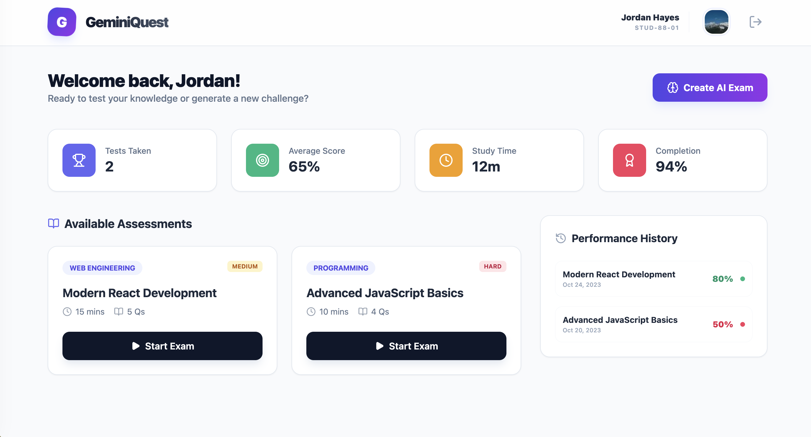
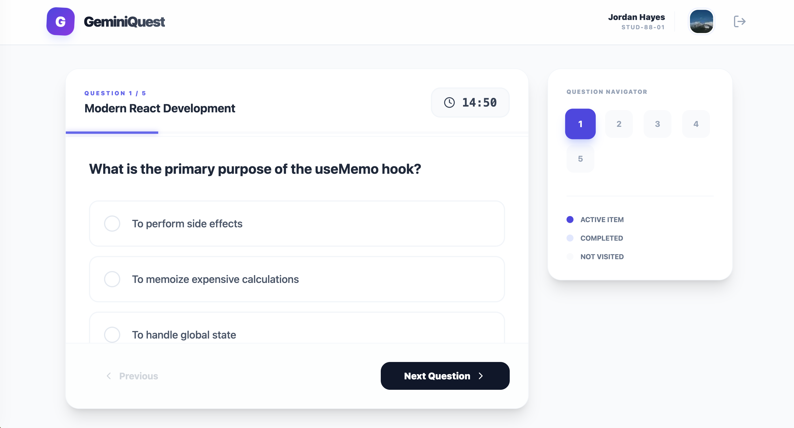
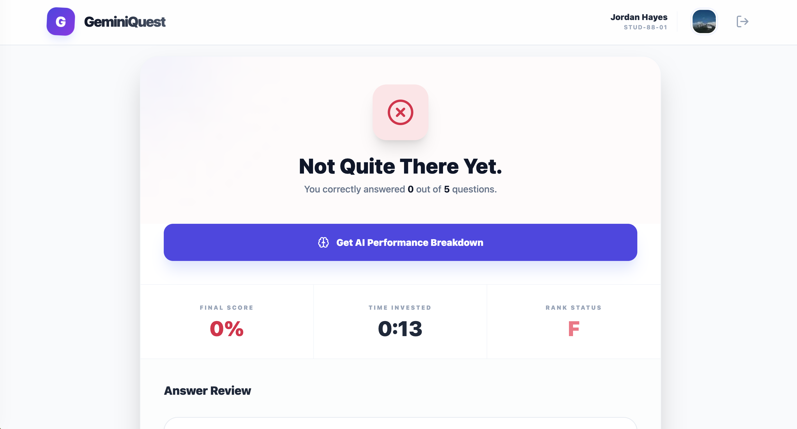

# GeminiQuest - AI-Powered Exam Platform

<div align="center">
  <h3>An intelligent exam platform powered by Google Gemini AI</h3>
  <p>Create, take, and analyze exams with AI-generated questions and personalized feedback</p>
</div>

## 📸 Screenshots

<div align="center">
  
  ### Dashboard View
  
  
  ### Exam View
  
  
  ### Results View
  
  
</div>

> **Note**: Add your screenshots to the `screenshots` folder. Recommended image names: `dashboard.png`, `exam.png`, `results.png`. You can take screenshots by running the app and capturing the views.

## 📋 Description

GeminiQuest is a modern, AI-powered examination platform built with React and TypeScript. It allows users to take pre-configured exams or generate custom exams on any topic using Google's Gemini AI. The platform provides detailed performance analytics, AI-generated feedback, and a comprehensive history tracking system.

### Key Features

- 🎯 **AI-Generated Exams**: Create custom exams on any topic using Gemini AI
- 📊 **Performance Dashboard**: Track your exam history, average scores, and study time
- 🎨 **Modern UI**: Beautiful, responsive interface built with Tailwind CSS
- ⏱️ **Timer System**: Real-time countdown timer for each exam
- 📈 **Detailed Analytics**: View performance metrics and exam history
- 🤖 **AI Feedback**: Get personalized study recommendations based on your performance
- 📝 **Answer Review**: Review all questions and answers after completing an exam
- 🔍 **Filtered History**: Filter performance history by specific exams

## 🛠️ Technologies Used

- **React 19** - UI library
- **TypeScript** - Type-safe JavaScript
- **Vite** - Build tool and dev server
- **Tailwind CSS** - Utility-first CSS framework
- **Google Gemini AI** - AI model for exam generation and feedback
- **Lucide React** - Icon library

## 📦 Prerequisites

Before you begin, ensure you have the following installed:

- **Node.js** (v18 or higher recommended)
- **npm** or **yarn** package manager
- **Google Gemini API Key** - Get yours from [Google AI Studio](https://makersuite.google.com/app/apikey)

## 🚀 Installation

1. **Clone the repository** (if you haven't already):
   ```bash
   git clone <repository-url>
   cd gemini-ai-exam-master
   ```

2. **Install dependencies**:
   ```bash
   npm install
   ```
   or
   ```bash
   yarn install
   ```

3. **Create environment file**:
   Create a `.env.local` file in the root directory:
   ```bash
   touch .env.local
   ```

4. **Configure API Key**:
   Add your Gemini API key to `.env.local`:
   ```env
   GEMINI_API_KEY=your_api_key_here
   ```
   
   > **Note**: Replace `your_api_key_here` with your actual Gemini API key from Google AI Studio.

## ▶️ Running the Application

### Development Mode

Start the development server:

```bash
npm run dev
```

or

```bash
yarn dev
```

The application will be available at `http://localhost:3000`

### Build for Production

Create an optimized production build:

```bash
npm run build
```

or

```bash
yarn build
```

The built files will be in the `dist` directory.

### Preview Production Build

Preview the production build locally:

```bash
npm run preview
```

or

```bash
yarn preview
```

## 📁 Project Structure

```
gemini-ai-exam-master/
├── components/          # Reusable UI components
│   ├── ExamCard.tsx    # Exam card component
│   ├── Navigation.tsx  # Navigation bar
│   └── StatCard.tsx    # Statistics card component
├── views/              # Page/View components
│   ├── Dashboard.tsx   # Main dashboard view
│   ├── ExamView.tsx    # Exam taking interface
│   └── ResultView.tsx  # Results and feedback view
├── services/           # API and external services
│   └── geminiService.ts # Gemini AI service integration
├── utils/              # Utility functions
│   └── formatting.ts   # Formatting helpers
├── types.ts            # TypeScript type definitions
├── constants.tsx       # Application constants and mock data
├── App.tsx             # Main application component
├── index.tsx           # Application entry point
├── vite.config.ts      # Vite configuration
└── package.json        # Dependencies and scripts
```

## 🎮 Usage Guide

### Taking Pre-configured Exams

1. Navigate to the Dashboard
2. Browse available exams in the "Available Assessments" section
3. Click "Start Exam" on any exam card
4. Answer questions using the navigation controls
5. Submit the exam to view results and feedback

### Creating AI-Generated Exams

1. Click the "Create AI Exam" button on the Dashboard
2. Enter a topic (e.g., "World War II", "Photosynthesis", "Python Decorators")
3. Click "Generate Exam"
4. Wait for the AI to generate your custom exam
5. Start taking the exam immediately

### Viewing Performance History

1. View your overall performance in the stats cards at the top
2. Click on any exam card to filter Performance History by that exam
3. Click the X button to clear the filter and see all history
4. Review detailed scores and dates in the Performance History sidebar

### Getting AI Feedback

1. Complete any exam
2. On the results page, click "Get AI Performance Breakdown"
3. Receive personalized feedback and study recommendations

## 🔧 Configuration

### Environment Variables

The application uses the following environment variable:

- `GEMINI_API_KEY`: Your Google Gemini API key (required for AI features)

### Vite Configuration

The application runs on port 3000 by default. You can modify this in `vite.config.ts`:

```typescript
server: {
  port: 3000,
  host: '0.0.0.0',
}
```

## 🐛 Troubleshooting

### API Key Issues

- Ensure your `.env.local` file is in the root directory
- Verify your API key is correct and has proper permissions
- Check that the environment variable name matches: `GEMINI_API_KEY`

### Port Already in Use

If port 3000 is already in use, you can:
- Stop the process using port 3000
- Modify the port in `vite.config.ts`

### Build Issues

- Clear node_modules and reinstall: `rm -rf node_modules && npm install`
- Clear Vite cache: `rm -rf node_modules/.vite`

## 📝 Notes

- The application uses mock data for pre-configured exams
- AI-generated exams require an active internet connection and valid API key
- Exam history is stored in browser memory (resets on page refresh)
- For production use, consider implementing proper data persistence

## 📄 License

This project is provided as-is for educational and development purposes.

## 🤝 Contributing

Contributions are welcome! Please feel free to submit a Pull Request.

---

**Built with ❤️ using React, TypeScript**